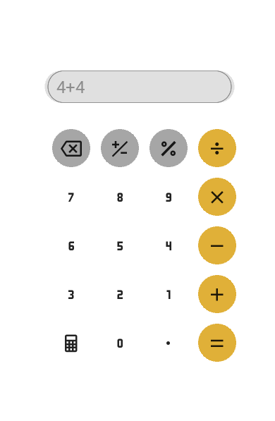

# 🧮 Simple Calculator (KivyMD + Kivy)

## 📌 About
A *simple and high-quality calculator app* developed with *KivyMD + Kivy*.  
It is designed to be:
- ✅ Easy to use  
- ✅ Minimal and elegant  
- ✅ Surrounded by a custom background image for a better UI/UX  

---

## 🚀 Features
- Basic arithmetic operations (+, −, ×, ÷, %)  
- Clear and Backspace functionality  
- Dark/Light modern UI with KivyMD  
- Responsive layout for desktop and mobile  

---

## 🛠️ Technologies Used
- [Python 3](https://www.python.org/)  
- [Kivy](https://kivy.org/)  
- [KivyMD](https://kivymd.readthedocs.io/)  

---

## 📷 Screenshots
| Calculator UI | Example |
|---------------|---------|
|  |  |

